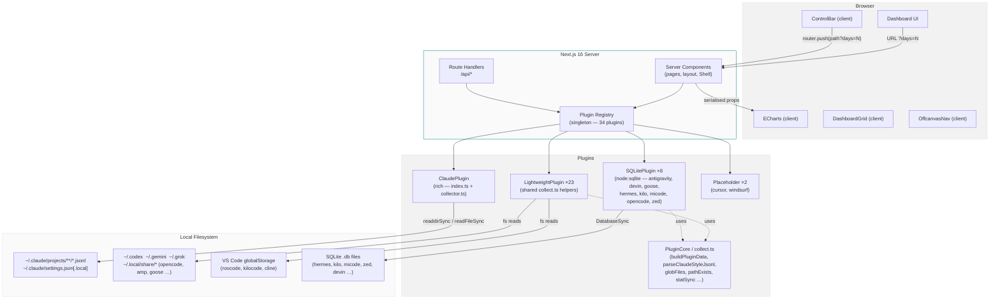
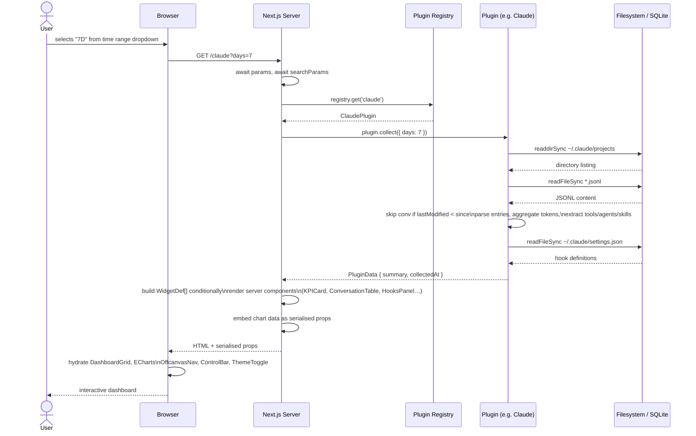
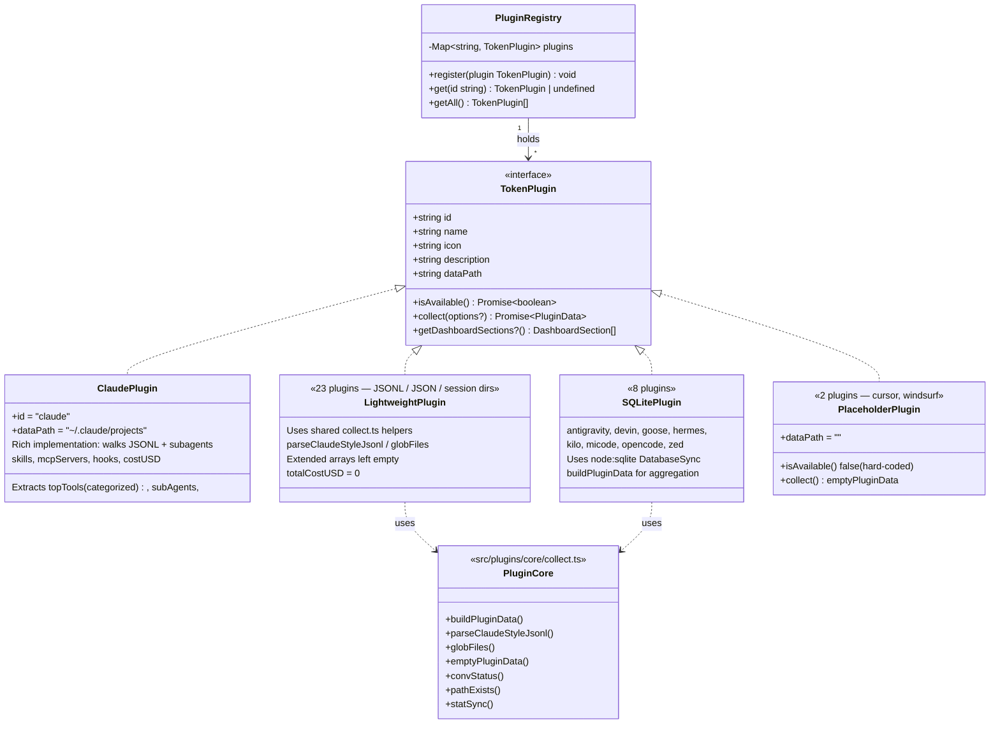
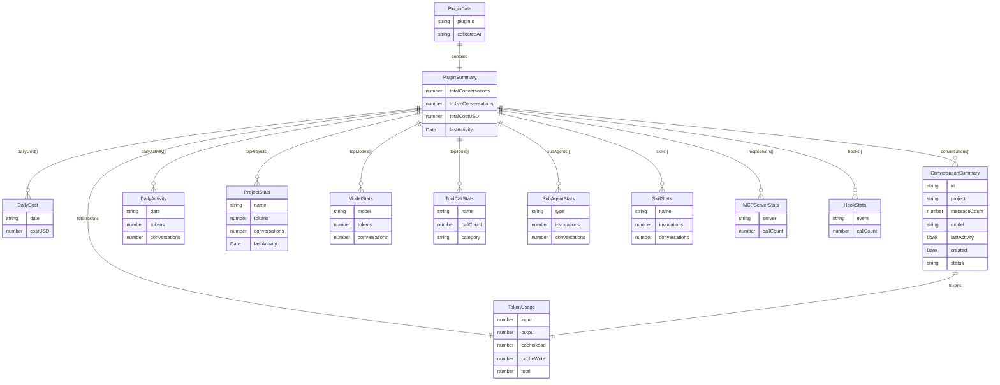

# Architecture

AI Token Tracker — system design, data flow, and module boundaries.

> **See also:** [`docs/project-understanding.md`](project-understanding.md) is the canonical current-state orientation map — read it first for a verified snapshot of the full system. This file goes deeper on design rationale, diagrams, and ADR-style decisions.

---

## Overview

The application is a **local-first, server-rendered dashboard** built on Next.js 16 App Router. It reads AI tool data directly from the local filesystem at request time — no database, no background sync, no auth. A plugin registry decouples tool-specific collection logic from the shared UI layer.

```
Browser → Next.js Server → Plugin Registry → Local Filesystem (JSONL logs, SQLite DBs, …)
                        ↓
                   React Server Components → HTML streamed to browser
                        ↓
              Client Components (charts, DashboardGrid, OffcanvasNav, ControlBar, theme) hydrated in browser
```

---

## System Overview



**Client / server boundary:** Everything above the dotted line in the component tree is a React Server Component. Only components that need browser APIs (`useRouter`, `useEffect`, ECharts DOM init) are marked `"use client"`. Server components receive no `useState` and carry no hydration payload beyond chart data.

---

## Request Lifecycle



---

## Component Tree

```mermaid
graph TD
    RL["RootLayout\n[server]"]
    SH["Shell\n[server]"]
    TB["TopBar\n[server]"]
    WM["Wordmark\n[server]"]
    TT["ThemeToggle\n[client]"]
    ON["OffcanvasNav\n[client — hamburger drawer]"]
    PG["PluginPage / OverviewPage\n[server]"]
    CB["ControlBar\n[client]"]
    RB["RefreshButton\n[client]"]
    AR["AutoRefresh\n[client]"]
    DG["DashboardGrid\n[client — react-grid-layout]"]
    KPI["KPICard\n[server]"]
    SEC["Section\n[server]"]
    PB["PluginBanner\n[server]"]
    PC2["PluginCard\n[server]"]
    TB2["TokenBreakdown\n[client — ECharts]"]
    CT2["CostTimeline\n[client — ECharts]"]
    TL["TimelineChart\n[client — ECharts]"]
    AH["ActivityHeatmap\n[client — ECharts]"]
    MC["ModelChart\n[client — ECharts]"]
    MSC["ModelStackedChart\n[client — ECharts]"]
    SA["SubAgentChart\n[client — ECharts]"]
    SK["SkillsChart\n[client — ECharts]"]
    MCP["MCPChart\n[client — ECharts]"]
    TT2["TopToolsChart\n[client — ECharts]"]
    TCD["ToolCategoryDonut\n[client — ECharts]"]
    DH["DurationHistogram\n[client — ECharts]"]
    HP["HooksPanel\n[server]"]
    CT["ConversationTable\n[server]"]
    PT["ProjectTable\n[server]"]
    EC["EChart wrapper\n[client]"]
    NE["NotificationEvaluator\n[client]"]

    RL --> SH
    SH --> TB
    SH --> PG
    TB --> WM
    TB --> TT
    TB --> ON
    PG --> CB
    PG --> AR
    CB --> RB
    PG --> DG
    DG --> KPI
    DG --> SEC
    DG --> PB
    SEC --> TB2
    SEC --> CT2
    SEC --> TL
    SEC --> AH
    SEC --> MC
    SEC --> MSC
    SEC --> SA
    SEC --> SK
    SEC --> MCP
    SEC --> TT2
    SEC --> TCD
    SEC --> DH
    SEC --> HP
    SEC --> CT
    SEC --> PT
    PG --> PC2
    PG --> NE
    TB2 --> EC
    CT2 --> EC
    TL --> EC
    AH --> EC
    MC --> EC
    MSC --> EC
    SA --> EC
    SK --> EC
    MCP --> EC
    TT2 --> EC
    TCD --> EC
    DH --> EC

    style TT fill:#008383,color:#fff
    style ON fill:#008383,color:#fff
    style CB fill:#008383,color:#fff
    style RB fill:#008383,color:#fff
    style AR fill:#008383,color:#fff
    style DG fill:#008383,color:#fff
    style NE fill:#008383,color:#fff
    style TB2 fill:#008383,color:#fff
    style CT2 fill:#008383,color:#fff
    style TL fill:#008383,color:#fff
    style AH fill:#008383,color:#fff
    style MC fill:#008383,color:#fff
    style MSC fill:#008383,color:#fff
    style SA fill:#008383,color:#fff
    style SK fill:#008383,color:#fff
    style MCP fill:#008383,color:#fff
    style TT2 fill:#008383,color:#fff
    style TCD fill:#008383,color:#fff
    style DH fill:#008383,color:#fff
    style EC fill:#008383,color:#fff
```



> Teal nodes = `"use client"`. White nodes = React Server Components.

---

## Plugin System



> **Known gap:** `src/plugins/devindesktop/` exists on disk but is not registered — it re-exports `DEVIN_PLUGIN` (which itself handles both CLI SQLite and Desktop NDJSON) and is never imported in `src/plugins/index.ts`.

---

## Data Model



---

## File Structure

```
aitokentracker/
├── src/
│   ├── app/
│   │   ├── globals.css                  # Full design token system (color, spacing, radius,
│   │   │                                #   motion, z-index, font-size, font-weight,
│   │   │                                #   tracking, line-height, opacity, shadows, sizes)
│   │   ├── layout.tsx                   # Root layout — Inter + JetBrains Mono + Bitcount
│   │   │                                #   Grid Double (localFont); suppressHydrationWarning
│   │   ├── page.tsx                     # Overview dashboard (server, reads searchParams)
│   │   ├── page.module.css
│   │   ├── [pluginId]/
│   │   │   ├── page.tsx                 # Per-plugin detail page (server)
│   │   │   └── page.module.css
│   │   └── api/
│   │       ├── plugins/route.ts         # GET → PluginStatus[]
│   │       ├── summary/route.ts         # GET ?days=N → aggregated summary
│   │       └── [pluginId]/data/route.ts # GET ?days=N → PluginData
│   │
│   ├── plugins/
│   │   ├── index.ts                     # Registers all 34 plugins; single import point
│   │   ├── core/
│   │   │   ├── types.ts                 # All shared types (TokenPlugin, PluginData, etc.)
│   │   │   ├── registry.ts              # PluginRegistry singleton
│   │   │   └── collect.ts               # Shared collection helpers: buildPluginData,
│   │   │                                #   parseClaudeStyleJsonl, globFiles, emptyPluginData,
│   │   │                                #   convStatus, pathExists, statSync
│   │   ├── claude/
│   │   │   ├── index.ts                 # ClaudePlugin — date gate on all aggregations
│   │   │   └── collector.ts             # Filesystem reader + JSONL parser (rich extraction)
│   │   └── <tool>/index.ts              # One dir per tool (34 total); each implements TokenPlugin
│   │                                    # using collect.ts helpers (JSONL / JSON / SQLite)
│   │
│   ├── components/
│   │   ├── charts/
│   │   │   └── EChart.tsx               # ECharts React wrapper (client, SVG renderer)
│   │   ├── dashboard/
│   │   │   ├── DashboardGrid.tsx        # Draggable/resizable widget grid (client,
│   │   │   │                            #   react-grid-layout); persists layout to localStorage
│   │   │   ├── KPICard.tsx              # Stat tile (server)
│   │   │   ├── Section.tsx              # Section wrapper with title (server)
│   │   │   ├── PluginCard.tsx           # Plugin overview card (server)
│   │   │   ├── PluginBanner.tsx         # "Not configured" / placeholder banner (server)
│   │   │   ├── TokenBreakdown.tsx       # Donut — input/output/cache split (client, useChartTheme)
│   │   │   ├── CostTimeline.tsx         # Bar chart — daily cost (client, useChartTheme)
│   │   │   ├── TimelineChart.tsx        # Bar chart — daily token usage (client, useChartTheme)
│   │   │   ├── ActivityHeatmap.tsx      # Calendar heatmap — annual activity (client, useChartTheme)
│   │   │   ├── ModelChart.tsx           # Horizontal bar — token usage per model (client, useChartTheme)
│   │   │   ├── ModelStackedChart.tsx    # Stacked bar — model breakdown (client, useChartTheme)
│   │   │   ├── SubAgentChart.tsx        # Donut — sub-agent invocations (client, useChartTheme)
│   │   │   ├── SkillsChart.tsx          # Horizontal bar — skill invocations (client, useChartTheme)
│   │   │   ├── MCPChart.tsx             # Donut — MCP server calls (client, useChartTheme)
│   │   │   ├── TopToolsChart.tsx        # Horizontal bar — all tool calls (client, useChartTheme)
│   │   │   ├── ToolCategoryDonut.tsx    # Donut — tool calls by category (client, useChartTheme)
│   │   │   ├── DurationHistogram.tsx    # Histogram — conversation durations (client, useChartTheme)
│   │   │   ├── HooksPanel.tsx           # Hook config + estimated fires (server)
│   │   │   ├── ConversationTable.tsx    # Paginated conversation list (server)
│   │   │   ├── ProjectTable.tsx         # Project stats table (server)
│   │   │   └── NotificationEvaluator.tsx # Renders null; fires browser notifications (client)
│   │   ├── layout/
│   │   │   ├── Shell.tsx                # App shell — TopBar + full-width main (no sidebar)
│   │   │   ├── TopBar.tsx               # Wordmark + ThemeToggle + OffcanvasNav
│   │   │   ├── OffcanvasNav.tsx         # Hamburger drawer — Overview + all plugins (client;
│   │   │   │                            #   ESC/backdrop close, focus management)
│   │   │   └── Wordmark.tsx             # Two-tone HEADLESSENGINEER wordmark, Bitcount font,
│   │   │                                #   Swap animation (server — CSS only, no hooks)
│   │   └── ui/
│   │       ├── Badge.tsx                # Status badge (active/recent/inactive/accent)
│   │       ├── ControlBar.tsx           # Time-range <select> + optional action slot
│   │       │                            #   + dataPath label (client)
│   │       ├── RefreshButton.tsx        # Manual refresh trigger (client, useTransition)
│   │       ├── AutoRefresh.tsx          # Periodic auto-refresh every N ms (client)
│   │       ├── Skeleton.tsx             # Loading skeleton shimmer
│   │       ├── ThemeToggle.tsx          # Light/dark toggle (client)
│   │       └── TimeRangeFilter.tsx      # Legacy pill selector — kept but not used in pages
│   │
│   ├── types/
│   │   └── node-sqlite.d.ts             # TypeScript types for node:sqlite (DatabaseSync etc.)
│   │                                    #   Used by all 8 SQLite-backed plugins
│   │
│   └── lib/
│       ├── format.ts                    # formatTokens, formatRelativeTime, formatNumber
│       ├── useChartTheme.ts             # Hook: resolves CSS tokens → hex via getComputedStyle(body)
│       └── notifications/
│           ├── types.ts                 # NotificationRule, NotificationContext, NotificationSeverity
│           ├── rules.ts                 # DAILY_TOKEN_LIMIT (50M) + DEFAULT_RULES array
│           ├── manager.ts               # NotificationManager class (permission, eval, dedup)
│           ├── useNotifications.ts      # React hook: wires context → manager
│           └── index.ts                 # Barrel export
│
├── docs/                                # Project documentation
├── public/
│   └── fonts/
│       └── BitcountGridDouble-Variable.ttf  # Brand wordmark font (variable, 100–900)
├── next.config.ts
├── tsconfig.json                        # strict mode, @/* → ./src/*
└── package.json
```

---

## Design Decisions

### 1. Server Components by default

**Decision:** All components are Server Components unless they require browser APIs.

**Rationale:** Token data is collected on the server (filesystem reads). Shipping pre-rendered HTML to the client avoids a loading waterfall and keeps sensitive filesystem paths server-side. Client bundle stays small — only ECharts and router interaction code are sent.

**Trade-off:** Chart data is embedded in the page payload; very large datasets (>10K conversations) could produce large HTML. Acceptable for a local analytics tool.

---

### 2. No cache layer

**Decision:** No in-memory or Redis cache. Every request re-reads the filesystem.

**Rationale:** JSONL files are written continuously by AI tools. A cache would either show stale data or require invalidation logic. File reads on a local SSD for ~500 conversations take <100ms — caching adds complexity for negligible gain.

**Trade-off:** Cold-start latency scales linearly with conversation count. Future mitigation: incremental read using `mtime` filtering.

---

### 3. ECharts over Recharts / Chart.js

**Decision:** ECharts 6 with a custom React wrapper using `useRef` + `useEffect`.

**Rationale:** ECharts has native calendar heatmap support (the `CalendarComponent`), handles large datasets efficiently via SVG renderer, and has no React peer dependency — important for React 19 compatibility. Recharts has known React 19 issues; Chart.js lacks the calendar primitive.

**Trade-off:** Manual wrapper component vs. a maintained React binding. Acceptable — the wrapper is ~60 lines and straightforward. ECharts cannot resolve CSS custom properties in its option objects; a `useChartTheme` hook bridges this by reading `getComputedStyle(document.body)` and returning resolved hex values.

---

### 4. CSS Modules over Tailwind

**Decision:** CSS Modules with design token custom properties from `globals.css`.

**Rationale:** The project rules (`styling.md`) mandate design tokens over utility classes. Tokens enforce the monochrome + one accent constraint at the CSS level. CSS Modules give component-scoped styles with zero runtime cost. Tailwind's purge tooling is also additional build complexity.

**Trade-off:** More files (`.module.css` per component). Worth it for token correctness.

---

### 5. `searchParams` as filter mechanism

**Decision:** Time range is stored in URL query params (`?days=N`), not React state.

**Rationale:** URL-driven state gives shareable links, browser back/forward support, and works with server components naturally — Next.js re-runs the server component with new `searchParams` on navigation. No `useState` + `useEffect` + `fetch` waterfall.

**Trade-off:** Each filter change triggers a full server render. On a local machine with fast SSD, this is imperceptible. If latency becomes noticeable, a client-side API fetch with `useTransition` can be layered in without changing the plugin interface.

---

### 6. Hook counts approximated from `settings.json`

**Decision:** Hook fire counts are estimated by matching the hook's `matcher` pattern against recorded tool call counts, not read from JSONL.

**Rationale:** Claude Code hooks run as external shell processes and write no entries to conversation JSONL files. The JSONL `type` field only takes values: `user`, `assistant`, `summary`, `mode`, `system`, `ai-title`, and a handful of internal types — none related to hooks. Settings files are the only reliable source of hook configuration.

**Trade-off:** Estimates can over-count (matcher `"Write|Edit"` matches all Write and Edit calls regardless of whether the hook actually ran). Displayed as "≈ N fires" with an explanatory note.

---

### 7. OffcanvasNav for tool switching; ControlBar for time range only

**Decision:** Tool navigation lives in an **OffcanvasNav** hamburger drawer (top-right of TopBar); `ControlBar` is narrowed to a single time-range `<select>` plus an optional action slot (`RefreshButton`) and a dataPath label.

**Rationale:** A persistent sidebar or a combined "view + time range" dropdown conflated two different interaction frequencies. Tool switching is infrequent (once per session); time range changes happen much more often. Separating them removes the view selector from ControlBar entirely, simplifying that component, while the off-canvas drawer keeps tool navigation accessible without consuming persistent horizontal space. The off-canvas panel overlays the full page, provides a full plugin list (34 tools) with availability indicators, and closes on ESC or backdrop click with focus management.

**Trade-off:** The off-canvas pattern requires an extra click to open. Acceptable because tool switching is infrequent. The ControlBar now renders only a single select and optional supplementary elements — no view-selector dropdown remains.

---

### 8. Notification system: rule-based, browser-native

**Decision:** Daily token threshold alerts use the OS-level browser `Notification` API with `requireInteraction: true`, not a custom in-app toast or banner.

**Rationale:**
- OS-level notifications are visible even if the dashboard tab is in the background or the user has scrolled past the notification area.
- `requireInteraction: true` prevents auto-dismissal — the alert stays until the user explicitly clicks the × button.
- A rule-based engine (`NotificationRule[]`) decouples the check logic from the delivery mechanism. Adding a new threshold is a single object in `rules.ts` with no other file changes.
- `sessionStorage` deduplication (`aitokentracker:notif_fired`) prevents the same rule from firing more than once per browser session, even across multiple page navigations.
- The browser's `tag` field (set to the rule ID) ensures only one OS notification per rule is queued — if one is already showing, the browser replaces rather than duplicates it.

**Data flow:** The server computes `todayTokens` from `dailyActivity` at render time and passes it as a plain prop to `<NotificationEvaluator>`. The client component derives the `NotificationContext` (`dailyTokens`, `dailyLimit`, `pctOfLimit`) and calls `useNotifications()` on mount. `NotificationEvaluator` renders `null` — it is a pure side-effect component.

**Trade-off:** Requires the user to grant browser notification permission. If denied, the feature is silently disabled with no fallback. This is acceptable for a local developer tool where prompting is a one-time event.

---

### 9. Draggable/resizable dashboard via react-grid-layout

**Decision:** Pages pass a `WidgetDef[]` array to `<DashboardGrid>` instead of rendering `<Section>` elements directly. `DashboardGrid` wraps `react-grid-layout`'s `Responsive` (legacy build) to give drag-and-drop reordering and corner-resize of every widget card.

**Rationale:** Analytics dashboards benefit from user-configurable layouts — different users prioritize different charts (token timeline vs. project breakdown vs. sub-agents). The grid lets users arrange widgets to match their workflow without any server changes. Layouts are persisted per-plugin to `localStorage` under the key `aitokentracker-layout-<pluginId>`, so preferences survive page reloads. New widgets added by future iterations are merged in at the bottom, never overwriting existing user positions.

**Mechanics:**
- Pages build `WidgetDef[]` conditionally — a widget is only included when its data is non-empty (avoids blank placeholders).
- An **Edit layout** button in the grid toolbar activates drag handles and corner resize grips.
- A **Reset layout** button (visible only in edit mode) clears localStorage and restores the default `defaultPos` grid defined in the page.
- Breakpoints: lg (1280px) / md (768px) / sm (480px) / xs (0); column counts 12 / 12 / 6 / 4.

**Trade-off:** Client-side layout state adds complexity — the grid hydrates from localStorage before the first paint, which requires a `useEffect`. The `react-grid-layout` dependency adds ~40 KB to the client bundle. Accepted as a worthwhile UX improvement; the dependency is well-maintained and has no React 19 compatibility issues.

---

## Extension Points

### Add a new tool plugin

1. Create `src/plugins/<toolid>/index.ts` implementing `TokenPlugin`
2. Register it in `src/plugins/index.ts`: `registry.register(MY_PLUGIN)`
3. The OffcanvasNav, overview plugin grid, and `/api/plugins` route pick it up automatically

The OffcanvasNav (`src/components/layout/OffcanvasNav.tsx`) populates from `registry.getAll()` passed down from the page — no changes needed.

| Feature | How |
|---|---|
| OffcanvasNav tool list | `OffcanvasNav` iterates plugins passed from the page (sourced via `registry.getAll()`) |
| Overview card | `PluginCard` on `/` shows tokens + conversations |
| Detail page | `/mytool` renders `app/[pluginId]/page.tsx` — no new file needed |
| API route | `GET /api/mytool/data?days=N` is handled by `app/api/[pluginId]/data/route.ts` |
| Availability state | "Not configured" banner shown when `isAvailable()` returns false |
| Time range filter | `searchParams.days` is passed to `collect()` automatically |

### Add a new chart component

1. Create `src/components/dashboard/MyChart.tsx` as a `"use client"` component
2. Accept typed data props (use types from `src/plugins/core/types.ts`)
3. Call `useChartTheme()` from `@/lib/useChartTheme` and use `theme.*` values in the ECharts option — never pass `'var(--*)'` strings directly to ECharts
4. Use `<EChart option={...} />` from `src/components/charts/EChart.tsx`
5. Add a `WidgetDef` entry in `src/app/[pluginId]/page.tsx`'s widget array, pointing to `<Section><MyChart /></Section>`

### Add a new API endpoint

1. Create `src/app/api/<name>/route.ts`
2. Export `async function GET(request: Request): Promise<Response>`
3. Import `registry` from `@/plugins` to access plugin data
4. Mark `export const dynamic = 'force-dynamic'` to prevent static caching

### Add a plugin-specific dashboard section

1. Add `getDashboardSections?(): DashboardSection[]` to your plugin implementation
2. In `src/app/[pluginId]/page.tsx`, call `plugin.getDashboardSections?.()` and render each section
3. Map section IDs to components using a registry object in the page file
