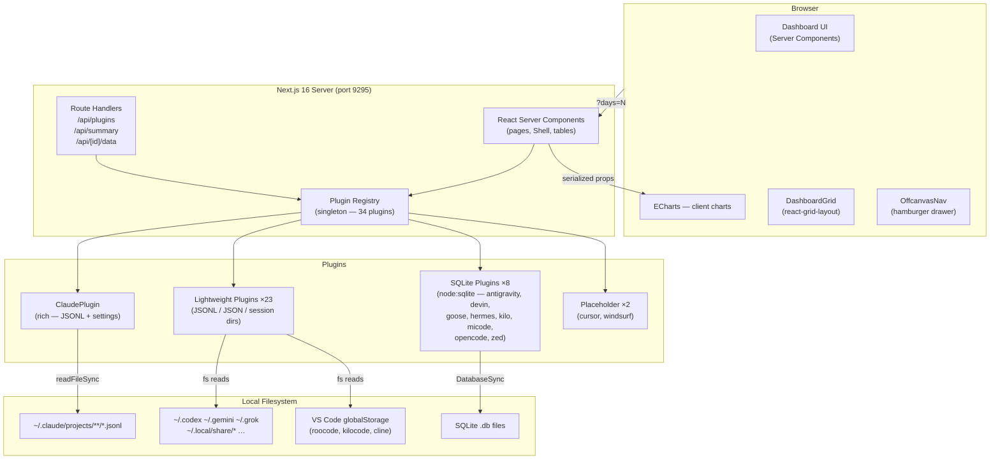
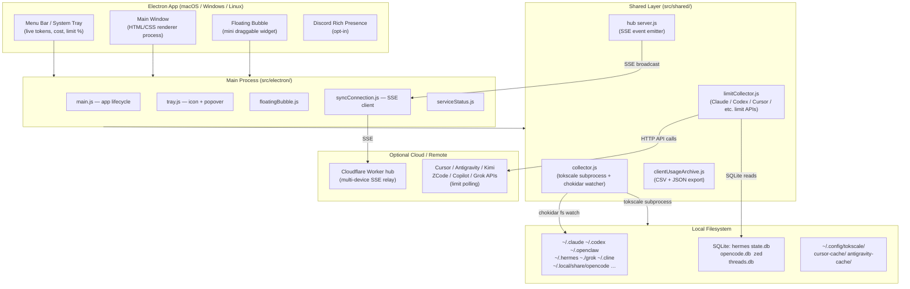
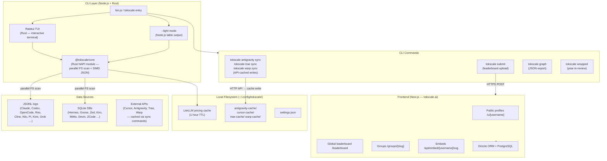
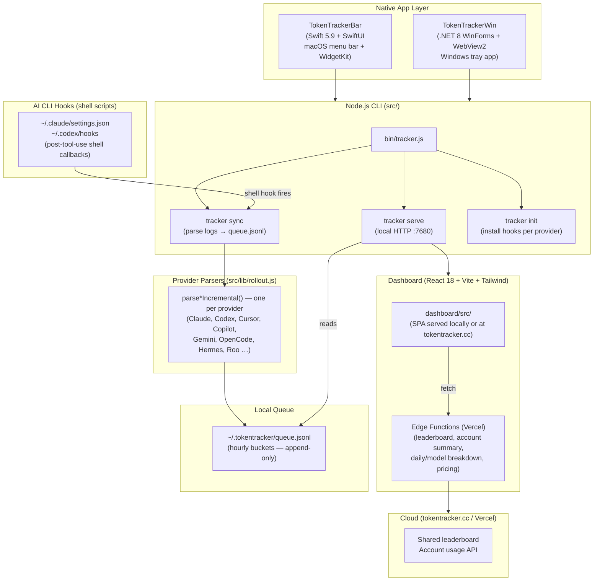

# AI Token Tracker — Ecosystem Comparison

A structured comparison of four tools in the AI-token-usage-analytics space: **AI Token Tracker** (this repo), **Token Monitor**, **Tokscale**, and **Token Tracker**.

---

## 1. Overview Table

| | **AI Token Tracker** | **Token Monitor** | **Tokscale** | **Token Tracker** |
|---|---|---|---|---|
| **Delivery model** | Local web dashboard (Next.js, port 9295) | Native desktop widget (Electron) | CLI TUI + hosted web frontend | CLI + macOS menu bar + Windows tray |
| **Primary language** | TypeScript (Next.js 16, React 19) | JavaScript (Node.js + Electron) | Rust (core) + TypeScript (frontend) | JavaScript/TypeScript (CLI) + Swift (macOS) + C# (Windows) |
| **Installation** | `npm run dev` — browser | DMG / AppImage / NSIS installer | `npx tokscale@latest` | `npm install` + optional native app |
| **Target platform** | Any browser (local-first server) | macOS 14+, Windows 10+, Linux x64 | macOS, Linux, Windows (via npm/bun) | macOS (menu bar), Windows (tray), any browser |
| **Tools tracked** | 34 plugins registered (all active) | 25+ tools with token data, 15 with limit detection | ~40+ tools | ~25+ tools via hook-based parsing |
| **Multi-device sync** | None (single-machine) | Yes — SSE hub (in-app, Node CLI, or Cloudflare Worker) | Social leaderboard only (submit opt-in) | Yes — `sync` command + Vercel-hosted cloud API |
| **Data persistence** | SQLite cache at `~/.config/aitokentracker/cache.db` (mtime-based, not user-visible) | `~/.tokentracker/queue.jsonl` append-log | `~/.config/tokscale/` cache files | `~/.tokentracker/queue.jsonl` |
| **Cost tracking** | Per-entry `costUSD` from JSONL | Yes, multi-currency (USD / TWD / HKD / CNY) | Yes, via LiteLLM real-time pricing | Yes, curated `pricing.json` + edge functions |
| **AI tool limits detection** | Partial (Claude rate-limit counters via `limits.ts`) | Yes (Claude, Codex, Cursor, Copilot, etc.) | Subscription quota via TUI Usage tab | Yes (Claude, Cursor, Copilot, OpenCode, etc.) |
| **Charts / visualisation** | ECharts 6 (heatmap, timeline, donut, histogram, stacked bar) | Custom HTML canvas widgets; trend chart; K-line | Ratatui TUI; web 2D/3D contribution graph | Recharts (web dashboard via Vite/React) |
| **Draggable dashboard** | Yes (react-grid-layout, localStorage persistence) | No | No | No |
| **Notifications** | Browser Notification API (rule-based daily limit) | OS notifications | None | None |
| **Data export** | CSV + JSON (`/api/export`, `ExportButton`) | CSV + JSON (manual or auto-folder) | JSON export (`--json`, `graph --output`) | JSON/CSV via API / edge functions |
| **Social / leaderboard** | No | Discord Rich Presence (opt-in) | Full leaderboard + public profiles + groups | Leaderboard via hosted tokentracker.cc |
| **Open source** | Yes (private repo) | MIT | MIT | MIT |
| **License** | Private | MIT | MIT | MIT |
| **Active version** | 0.1.0 (dev) | 0.28.0 | v4.x | varies by sub-package |

---

## 2. Architecture Diagrams

### 2.1 AI Token Tracker

### 2.2 Token Monitor

### 2.3 Tokscale

### 2.4 Token Tracker

---

## 3. Data Collection Sources

| Tool / Format | **AI Token Tracker** | **Token Monitor** | **Tokscale** | **Token Tracker** |
|---|---|---|---|---|
| **Claude Code JSONL** (`~/.claude/projects/**/*.jsonl`) | ✅ Rich — extracts tools, agents, skills, MCP, hooks, `costUSD` | ✅ via tokscale subprocess + chokidar | ✅ Native Rust parser (SIMD JSON) | ✅ `parseClaudeIncremental()` in rollout.js |
| **Codex sessions** (`~/.codex/sessions/`) | ✅ Parses delta `token_count` events, dedupes archived | ✅ | ✅ | ✅ |
| **OpenCode SQLite** (`~/.local/share/opencode/`) | ✅ via `node:sqlite` | ✅ | ✅ | ✅ |
| **VS Code globalStorage** (Roo, Cline, Kilo) | ✅ (roocode, cline, kilocode plugins) | ✅ Cline + Kilo Code | ✅ Roo, Kilo, Cline | Roo (via rollout.js) |
| **Hermes SQLite** (`state.db`) | ✅ | ✅ | ✅ | ✅ |
| **Gemini CLI JSON** (`~/.gemini/tmp/`) | ✅ | Partial (limit only) | ✅ | ✅ |
| **Zed SQLite** (`threads.db`) | ✅ | ✅ | ✅ | No |
| **Antigravity** | ✅ (reads DB directly) | ✅ (via tokscale cache) | ✅ (sync command → cache or direct SQLite for CLI) | Partial |
| **Cursor** | ✅ (API auth CSV from `state.vscdb`) | ✅ (API-cached CSV) | ✅ (API-cached) | ✅ |
| **GitHub Copilot** | ✅ (OTEL JSONL + workspaceStorage) | ✅ | ✅ | ✅ |
| **Grok Build** (`~/.grok/sessions/`) | ✅ | ✅ | ✅ | ✅ |
| **Kiro** | ✅ (CLI JSON + SQLite + IDE globalStorage) | ✅ | ✅ | No |
| **External limit APIs** (DeepSeek, Minimax, Qoder, Ollama, Volcengine) | ❌ | ✅ (API key / cookie polling) | Subscription quota via TUI | Partial (Claude, Codex, Cursor) |
| **Multi-device sync (SSE)** | ❌ | ✅ (in-app hub, Node CLI hub, Cloudflare Worker) | ❌ (social submit only) | ✅ (Vercel edge API) |
| **Hook-intercepted data** | Approximated from `settings.json` | Not applicable | Not applicable | ✅ Shell hooks fire on tool-use |
| **Live filesystem watch** | ✅ chokidar SSE watcher (`/api/stream`) | ✅ chokidar watcher | ❌ (on-demand scan) | ✅ (auto-sync via hooks) |
| **LiteLLM real-time pricing** | ❌ (static per-plugin `pricing.ts`) | ✅ (via tokscale) | ✅ (1-hour disk cache) | ❌ (curated JSON overrides) |

---

## 4. Pros & Cons

### 4.1 AI Token Tracker (this repo)

**Pros**
- Zero-config for the core use case — no accounts, no API keys, no sync setup.
- Rich Claude plugin: sub-agent breakdown, skill/MCP/hook analytics not available elsewhere.
- Draggable, resizable dashboard (react-grid-layout) with per-plugin localStorage persistence.
- Server components stream pre-rendered HTML; charts hydrate lazily — fast first paint.
- Extensible plugin architecture: one file + one registration line per new tool.
- CSS-Module design system with a single brand accent — no Tailwind purge complexity.
- 34 plugins covering a wide variety of AI coding tools.

**Cons**
- No multi-device sync — data is locked to one machine.
- No mobile or tray access — requires an open browser tab.
- No LiteLLM real-time pricing — costs use a static per-plugin pricing table.
- No external API limit detection beyond Claude's own rate-limit counters.

---

### 4.2 Token Monitor

**Pros**
- Persistent desktop presence: system tray / menu-bar icon with live tokens, cost, and limit % at a glance.
- Multi-device SSE sync — each machine watches its own logs, hub broadcasts deltas.
- Live filesystem watching via chokidar — dashboard updates within seconds of each AI turn.
- Widest tool coverage for AI limits: 15 providers with quota/window detection.
- Multi-currency cost display with daily auto-updated exchange rates.
- Per-session detail: expandable prompt-level token splits for Claude, Codex, OpenCode.
- iOS widget support via Widgy / Scriptable through the Worker hub.
- Data export (CSV + JSON), Discord Rich Presence, floating bubble mode.
- Ships as an installable native app — no terminal or Node knowledge needed.
- Cloudflare Worker sync backend is self-hostable for privacy-conscious users.

**Cons**
- Electron bundle (~200 MB+) for what is essentially a widget.
- No rich analytics: no tool-use breakdown, sub-agent charts, skill/MCP analytics.
- No draggable dashboard — fixed widget layout.
- Sync backend requires setup (port, auth) for multi-device use.
- Delegating collection to a tokscale subprocess adds a process dependency and startup latency.
- Closed-source business logic for limit API parsing (scraping cookies / OAuth flows).
- Per-session detail only for Claude, Codex, OpenCode — other tools show aggregate only.

---

### 4.3 Tokscale

**Pros**
- Rust core delivers ~10× faster parsing vs. pure JS — handles millions of sessions without latency spikes.
- Broadest tool coverage (~40 tools), including niche ones (Synthetic, Droid, WorkBuddy, Crush).
- Interactive TUI with keyboard + mouse — no browser or Electron required.
- Real-time LiteLLM pricing with OpenRouter fallback — always accurate costs.
- Social platform: public profiles, global leaderboard, groups, shareable README widgets.
- Flexible grouping strategies (model / client+model / workspace+session+model).
- GitHub-style contribution graph in 2D and 3D.
- LLM-powered task attribution for session summarization.
- `npx tokscale@latest` — zero installation, runs anywhere Node/Bun is available.
- Published npm package with pre-built native binaries for all major platforms.

**Cons**
- No persistent live monitoring — on-demand scan only, not a watching daemon.
- No multi-device sync outside the opt-in social submit flow.
- TUI requires a terminal — no GUI for non-technical users.
- Frontend requires external hosting (tokscale.ai) or self-hosting the Next.js app + PostgreSQL.
- Cursor, Antigravity, Trae, and Warp require explicit `sync` commands to cache data — not automatic.
- No desktop tray / menu bar integration.
- Hook counts or fine-grained tool-use analytics not surfaced in TUI.

---

### 4.4 Token Tracker

**Pros**
- Hook-based collection: data is pushed by the AI tool's own hook on every tool-use call — most accurate count.
- Cross-platform native shell: macOS menu bar (Swift + WidgetKit) and Windows tray (C# WinForms + WebView2) with self-contained bundled Node runtime.
- Hosted cloud leaderboard (tokentracker.cc) with Vercel edge functions for low-latency global queries.
- Shared queue format (`queue.jsonl`) is append-only and provider-agnostic — easy to extend.
- Dashboard built in React 18 + Vite + Tailwind — familiar stack, easy to customise.
- WidgetKit integration on macOS for lock-screen / home-screen widgets.
- `tracker init` installs hooks automatically across providers.
- Half-hour time buckets support fine-grained hourly cost breakdowns.
- 97-test suite with extensive provider-parser coverage.

**Cons**
- Hook-based collection means you must run `tracker init` per-machine to activate — passive monitoring requires setup.
- macOS app requires Xcode 26+ and XcodeGen to build — high barrier for contributors.
- Windows app is an MVP: no live cost in tray icon, no native ↔ web bridge, no auto-update.
- No rich per-conversation analytics (tool-use breakdown, sub-agents, skills).
- Pricing data maintained in a curated JSON override + 5 Vercel edge files — sync drift is a real maintenance risk.
- No draggable / configurable dashboard layout.
- Dashboard SPA (not SSR) — initial bundle load before first data render.

---

## 5. Feature Coverage Matrix

| Feature | AI Token Tracker | Token Monitor | Tokscale | Token Tracker |
|---|:---:|:---:|:---:|:---:|
| Token usage tracking | ✅ | ✅ | ✅ | ✅ |
| Cost in USD | Partial (Claude only) | ✅ | ✅ | ✅ |
| Multi-currency | ❌ | ✅ | ❌ | ❌ |
| Real-time pricing | ❌ | ✅ (via tokscale) | ✅ | ❌ |
| Live filesystem watch | ✅ (SSE) | ✅ | ❌ | ✅ (via hooks) |
| Multi-device sync | ❌ | ✅ | ❌ | ✅ |
| AI tool limit detection | Partial (Claude) | ✅ | Partial | Partial |
| Per-session detail | ❌ | ✅ (Claude/Codex/OC) | ❌ | ❌ |
| Sub-agent analytics | ✅ | ❌ | ❌ | ❌ |
| Skill / MCP analytics | ✅ | ❌ | ❌ | ❌ |
| Hook fire analytics | ✅ (approx.) | ❌ | ❌ | ❌ |
| Draggable dashboard | ✅ | ❌ | ❌ | ❌ |
| Calendar heatmap | ✅ | ❌ | ✅ (contribution graph) | ❌ |
| Social leaderboard | ❌ | Discord RPC only | ✅ | ✅ |
| Data export | ✅ (CSV + JSON) | ✅ (CSV + JSON) | ✅ (JSON) | ✅ (JSON / API) |
| Tray / menu bar | ❌ | ✅ | ❌ | ✅ |
| iOS widget | ❌ | ✅ (via Worker hub) | ❌ | ✅ (WidgetKit) |
| Dark / light mode | ✅ | ✅ | ✅ (12 themes) | ✅ |
| Notifications | ✅ (browser) | ✅ (OS) | ❌ | ❌ |
| Zero install | ❌ (npm run dev) | ❌ (DMG/installer) | ✅ (npx) | ❌ |
| Open source | ✅ (private) | ✅ MIT | ✅ MIT | ✅ MIT |

---

## 6. When to Use Which

| Use case | Best fit |
|---|---|
| Deep Claude Code analytics (sub-agents, tools, MCP, hooks) | **AI Token Tracker** |
| Single-developer, local-only usage monitor without setup | **AI Token Tracker** or **Tokscale** |
| Live desktop widget with tray presence, multi-device, currency conversion | **Token Monitor** |
| Terminal-first workflow, fastest cold-start, broadest tool count | **Tokscale** |
| Leaderboard / social ranking / public profile for your usage | **Tokscale** |
| Cross-platform native app (macOS menu bar + Windows tray) in one install | **Token Monitor** |
| Hook-accurate data collection with most precise per-hour buckets | **Token Tracker** |
| Team/org usage leaderboard hosted in the cloud | **Token Tracker** |
